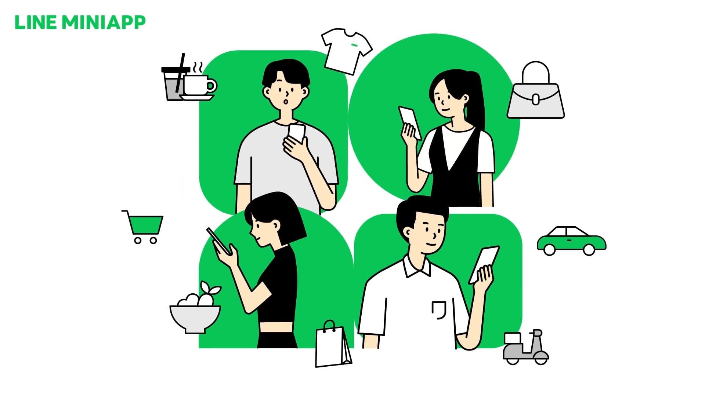
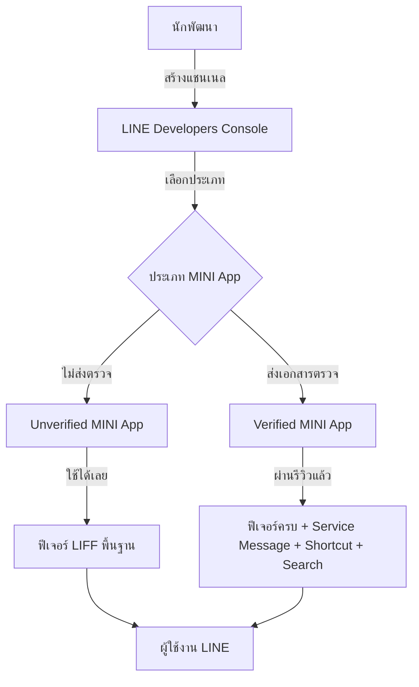
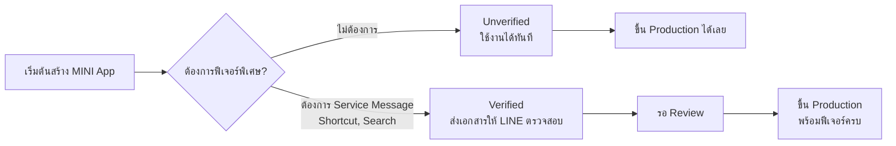
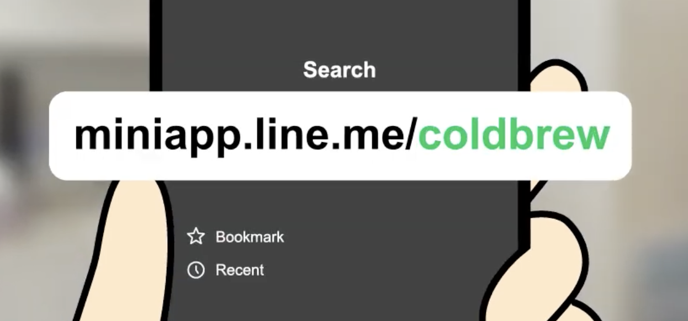
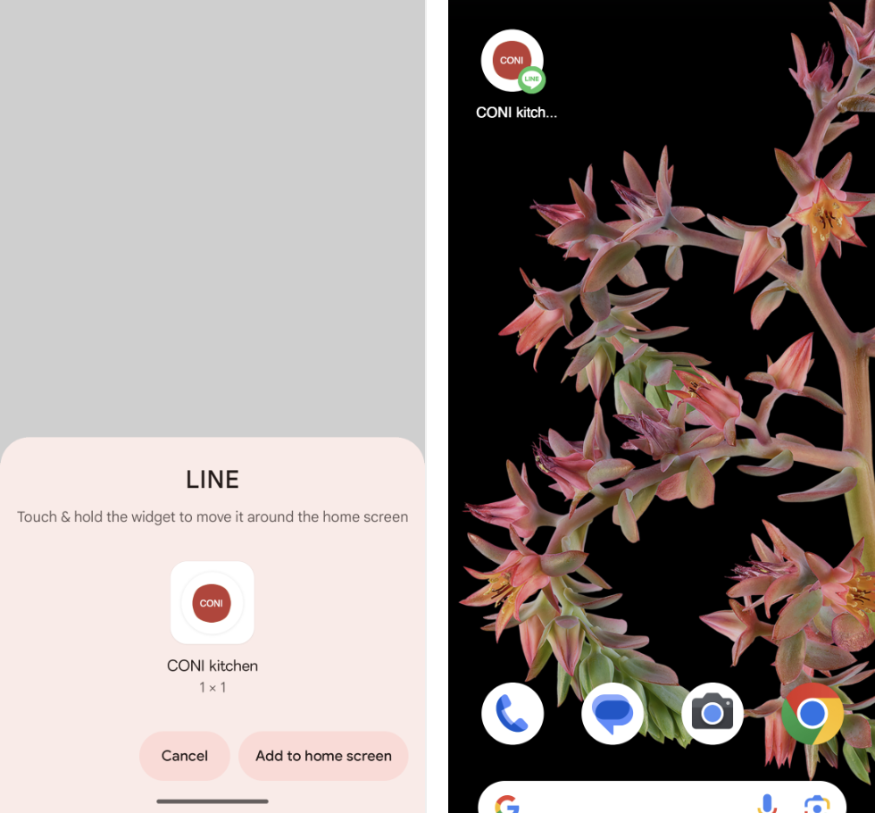
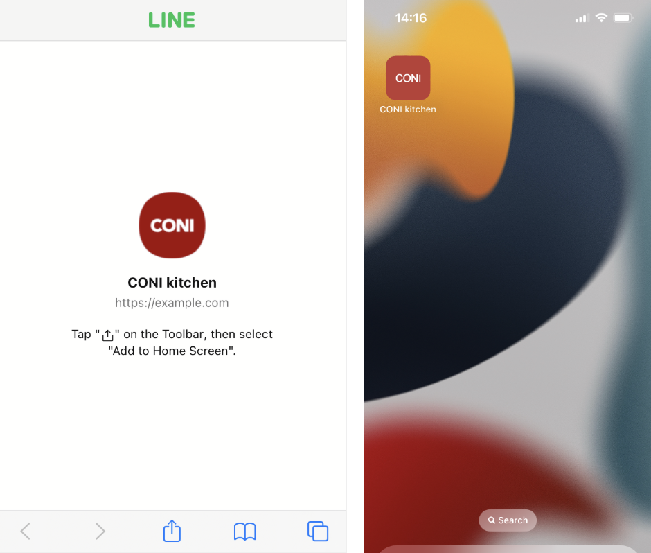
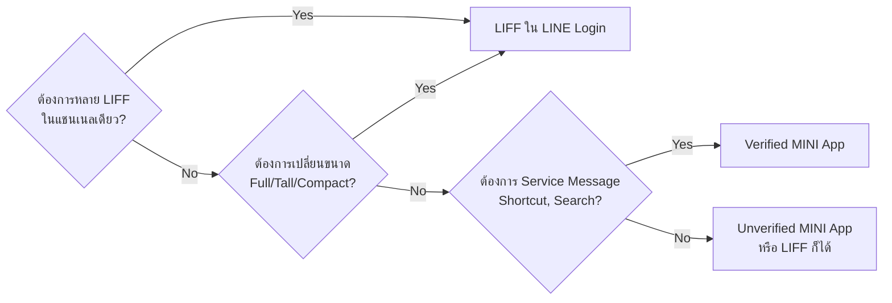

# LINE MINI App — เว็บแอปที่อยู่ใน LINE โดยไม่ต้องลงแอปแยก

> อยากให้ลูกค้าเปิดใช้งานแอปของคุณโดย **ไม่ต้องดาวน์โหลด ไม่ต้องสมัครสมาชิกใหม่ และไม่ต้องรีเซ็ตรหัสผ่าน** ใช่ไหม? — **LINE MINI App** คือคำตอบ มันคือเว็บแอปที่ทำงานอยู่ภายใน LINE ใช้ Account เดียวกับ LINE ผู้ใช้เข้าถึงได้ทันทีจากในแอปที่เขาใช้ทุกวันอยู่แล้ว ทำให้ Conversion Rate ของการใช้งานครั้งแรกสูงกว่าแอปปกติหลายเท่า

**LINE MINI App** เป็นอีกหนึ่งบริการที่หลาย ๆ คนอาจจะได้ยินชื่อมาสักระยะหนึ่งแล้ว แต่ไม่ค่อยเป็นที่นิยม เพราะก่อนหน้านี้การพัฒนา LINE MINI App จำเป็นที่จะต้องยื่นเอกสารต่าง ๆ นานามากมาย เพื่อการพัฒนาและการใช้งานจริง ๆ

แต่ในปัจจุบัน LINE ได้ประกาศเตรียมตัวรีแบรนด์ LIFF (LINE Front-end Framework) จากในแชนเนล LINE Login ให้มาใช้ที่ LINE MINI App แทน โดยตอนนี้ในระดับ Global ทาง LINE ได้ประกาศเปิดให้นักพัฒนาทั่วไปสามารถสร้าง LINE MINI App ได้เองแล้ว โดยที่ไม่ต้องยื่นเอกสาร แต่สำหรับประเทศไทย จะสามารถทำได้เช่นกันในอนาคตอันใกล้

[](https://youtu.be/yYgVI9rKDVg)

## ทำไมต้องรู้เรื่องนี้?

ลองนึกภาพว่าคุณทำแอปร้านกาแฟ — ถ้าเป็นแอปปกติ ลูกค้าต้องไป App Store, กดดาวน์โหลด, รอโหลด 50MB, เปิดแอป, สมัครสมาชิก, ยืนยันอีเมล... ขั้นตอนเยอะขนาดนี้คนเลิกใช้ไปครึ่งทางแน่นอน

**LINE MINI App** ตัดขั้นตอนพวกนี้ทิ้งทั้งหมด เพียงแค่ผู้ใช้กดลิงก์ แอปก็เปิดทันทีใน LINE ใช้ Account LINE ที่มีอยู่แล้ว ไม่ต้องสมัครใหม่ แถมยังมีฟีเจอร์พิเศษที่แอปเว็บธรรมดาทำไม่ได้ เช่น ส่งข้อความแจ้งเตือน (Service Message), เพิ่มทางลัดลงหน้าจอโฮม, หรือถูกค้นหาเจอจาก LINE Search

**ประโยชน์จริง:**
- ลดขั้นตอน Onboarding — ไม่ต้องดาวน์โหลด, สมัครสมาชิกใหม่
- เข้าถึงข้อมูลโปรไฟล์ LINE ได้ทันที (ชื่อ, รูป, อีเมล)
- ส่งข้อความแจ้งเตือนผ่าน LINE MINI App Notice (สำหรับ Verified)
- เพิ่มช่องทางการเข้าถึง — ผ่าน LINE Search, Services Tab, Home Screen Shortcut

## ภาพรวม



## LINE MINI App ยังคงต้องส่งเอกสารเพื่อพัฒนาและเผยแพร่หรือไม่

ในการพัฒนาสามารถสร้างและพัฒนาได้เลยจากใน [LINE Developers Console](https://developers.line.biz/console) โดย LINE MINI App ที่จะเผยแพร่บน Production จะถูกแยกเป็น 2 ประเภท คือ

- **Verified MINI App** — ต้องยื่นเอกสารกับ LINE เพื่อรับการตรวจสอบและเผยแพร่ขึ้น Production
- **Unverified MINI App** — ไม่ต้องยื่นเอกสารให้ LINE ตรวจสอบ สามารถนำขึ้น Production และใช้งานได้ทันที

## Verified MINI App vs. Unverified MINI App



ตารางเปรียบเทียบฟีเจอร์อย่างละเอียด

| ฟีเจอร์                            | Verified MINI App | Unverified MINI App |
| ---------------------------------- | :---------------: | :-----------------: |
| ความสามารถ LIFF                    |        ✅         |         ✅          |
| ใช้งานบน Browser (ต.ค.​ 2025)      |        ✅         |         ✅          |
| ระบบชำระเงิน (อนาคต)               |        ✅         |         ✅          |
| แนะนำ LINE OA เพื่อเพิ่มเพื่อน     |        ✅         |         ✅          |
| เปลี่ยนแปลง URL (Custom Path)      |        ✅         |                     |
| ข้อความแจ้งเตือน (Service Message) |        ✅         |                     |
| เพิ่มทางลัดที่หน้าจอโฮม            |        ✅         |                     |
| ข้ามการขออนุญาต (Channel Consent Simplification) |        ✅         |                     |
| ซ่อน URL เข้าถึง พร้อมไอคอนยืนยัน  |        ✅         |                     |
| ค้นหาได้จาก LINE Search            |        ✅         |                     |
| แสดงในบริการที่ใช้ล่าสุด (สูงสุด 8 รายการ) บน Home Tab |        ✅         |                     |
| Common Profile Quick-fill          |        ✅         |                     |

### ข้อจำกัดของ Unverified MINI App

นอกจากจะไม่สามารถใช้ฟีเจอร์ข้างต้นได้แล้ว Unverified MINI App ยังมีข้อจำกัดเพิ่มเติม ดังนี้

- **ไม่สามารถใช้ Module Mode ได้** — ไม่สามารถซ่อน Action Button บน LINE MINI App ได้ และไม่สามารถตั้งค่า Module Mode สำหรับ LIFF App ที่เพิ่มในแชนเนล LINE MINI App ได้
- **ไม่สามารถเพิ่ม Web App หลายตัวในแชนเนลเดียวกันได้** — ในแชนเนล LINE MINI App ไม่สามารถเพิ่ม Web App หลายตัวในแชนเนลเดียวกันได้

## ฟีเจอร์ LINE MINI App ที่น่าสนใจ

- ข้อความแจ้งเตือน (Service Message) <span></span>

  

- เปลี่ยนแปลง URL (Custom Path) <span></span>

  

- เพิ่มทางลัดที่หน้าจอโฮม (Add to Home Screen) <span></span>

  

  

- ข้ามการขออนุญาต (Channel Consent Simplification) <span></span>

  สำหรับ Verified MINI App ผู้ใช้จะต้องยินยอมให้สิทธิ์เพียงครั้งเดียว หลังจากนั้นเมื่อเข้าถึง LINE MINI App ตัวอื่นเป็นครั้งแรก หน้าจอขออนุญาตจะถูกข้ามไป ทำให้ผู้ใช้สามารถเริ่มใช้งาน LINE MINI App ได้ทันที

- ค้นหาจาก LINE Search <span></span>

  ผู้ใช้สามารถค้นหาและเข้าถึง LINE MINI App ที่เป็น Verified MINI App ได้จากฟีเจอร์ค้นหาของ LINE โดยตรง

- แสดงในบริการที่ใช้ล่าสุดบน Home Tab <span></span>

  ผู้ใช้สามารถเข้าถึง LINE MINI App ที่ใช้ล่าสุดได้จากส่วน **Services** บนแท็บ **Home** ของ LINE โดยจะแสดงสูงสุด 8 รายการ เรียงตามลำดับการใช้งานล่าสุด (เฉพาะ Verified MINI App เท่านั้น)

## Custom Path (การตั้งค่า URL ที่กำหนดเอง)

Custom Path เป็นฟีเจอร์สำหรับ Verified MINI App ที่ช่วยให้สามารถตั้งค่า string ที่กำหนดเองใน LIFF URL ได้ แทนที่จะใช้ LIFF ID ที่เป็นตัวเลขและตัวอักษรแบบสุ่ม ทำให้ URL ดูสวย จำง่าย และดูน่าเชื่อถือมากขึ้น

| ตัวอย่าง URL ปกติ (LIFF ID)             | ตัวอย่าง URL ที่ตั้ง Custom Path       |
| --------------------------------------- | ------------------------------------- |
| `https://miniapp.line.me/123456-abcdefg` | `https://miniapp.line.me/cony_coffee` |

### เงื่อนไขของ Custom Path

- ความยาวขั้นต่ำ 4 ตัวอักษร สูงสุด 29 ตัวอักษร
- ใช้ได้เฉพาะตัวอักษรภาษาอังกฤษตัวเล็ก (`a-z`), ตัวเลข (`0-9`) และ underscore (`_`)
- ไม่สามารถใช้ underscore (`_`) เป็นตัวอักษรสุดท้ายได้
- ไม่สามารถใช้ตัวเลขเพียงอย่างเดียว
- ไม่อนุญาตให้ใช้ช่องว่าง
- ต้องมีชื่อเฉพาะ (proper noun) ที่ระบุแบรนด์หรือบริการ
- เมื่อตั้งค่าแล้วจะไม่สามารถเปลี่ยนแปลงได้

### วิธีสมัครใช้งาน (สำหรับประเทศไทย)

สำหรับผู้ให้บริการในประเทศไทย หากต้องการใช้ฟีเจอร์ Custom Path กรุณาติดต่อตัวแทนฝ่ายขาย (Sales Representative) ของ LINE

> **หมายเหตุ:** แม้จะตั้ง Custom Path แล้ว URL เดิมที่ใช้ LIFF ID ยังคงเข้าถึงได้ตามปกติ และสามารถสมัคร Custom Path ก่อนที่ LINE MINI App จะผ่านการตรวจสอบได้ แต่ Custom Path จะถูกตั้งค่าหลังจากผ่านการตรวจสอบแล้วเท่านั้น

## Permanent Links (ลิงก์ถาวร)

ผู้ใช้สามารถเข้าถึง LINE MINI App ได้ทั้งจาก LIFF URL และ Permanent Link โดย Permanent Link ควรถูกใช้สำหรับการแชร์หน้า LINE MINI App

### สูตรการสร้าง Permanent Link

```
LIFF URL + (URL ของหน้า LINE MINI App - Endpoint URL) = Permanent Link
```

**ตัวอย่าง:**

| รายการ                          | ค่า                                               |
| ------------------------------- | ------------------------------------------------- |
| LIFF URL                        | `https://miniapp.line.me/123456-abcedfg`          |
| URL ของหน้า LINE MINI App       | `https://example.com/shop?search=shoes#item10`    |
| Endpoint URL                    | `https://example.com`                             |

Permanent Link ที่ได้คือ

```
https://miniapp.line.me/123456-abcedfg/shop?search=shoes#item10
```

> **หมายเหตุ:** ตั้งแต่วันที่ 13 ธันวาคม 2023 LIFF URL ของ LINE MINI App ได้เปลี่ยนเป็น `https://miniapp.line.me/{liffId}` แล้ว แต่ URL เดิม `https://liff.line.me/{liffId}` ยังคงใช้งานได้ตามปกติ

## LINE MINI App vs. LIFF

ปัจจุบันอยู่ในระยะถ่ายผ่านจาก LIFF ในแชนเนล LINE Login สู่ LINE MINI App การรีแบรนด์ยังไม่เรียบร้อยดี LIFF และ LINE MINI App ยังมีฟีเจอร์ที่ต่างกันอยู่เล็กน้อย การเลือกใช้งานต้องพิจารณาจากลักษณะการใช้งานอีกที



ตารางเปรียบเทียบแบบละเอียด

| ฟีเจอร์                                       | LIFF |         Unverified MINI App         |          Verified MINI App          |
| --------------------------------------------- | :--: | :---------------------------------: | :---------------------------------: |
| สร้างได้หลาย LIFF App ในแชนเนลเดียวกัน        |  ✅  | แยก 3 สภาพแวดล้อม ไม่สามารถเพิ่มได้ | แยก 3 สภาพแวดล้อม ไม่สามารถเพิ่มได้ |
| เปลี่ยนขนาดของ LIFF App (Full, Tall, Compact) |  ✅  |                                     |                                     |
| ซ่อน Action Button (Module Mode)              |  ✅  |                                     |                                     |
| ดึงข้อมูลโปรไฟล์ (`liff.getProfile()`)        |  ✅  |                 ✅                  |                 ✅                  |
| ส่งข้อความ (`liff.sendMessages()`)            |  ✅  |                 ✅                  |                 ✅                  |
| แชร์ข้อความ (`liff.shareTargetPicker()`)      |  ✅  |                 ✅                  |                 ✅                  |
| ใช้งานบน Browser                              |  ✅  |           ✅ (ต.ค.​ 2025)           |           ✅ (ต.ค.​ 2025)           |
| ข้อความแจ้งเตือน (Service Message)            |      |                                     |                 ✅                  |
| เปลี่ยนแปลง URL (Custom Path)                 |      |                                     |                 ✅                  |
| เพิ่มทางลัดที่หน้าจอโฮม                       |      |                                     |                 ✅                  |
| ข้ามการขออนุญาต (Channel Consent Simplification) |      |                                     |                 ✅                  |
| ซ่อน URL เข้าถึง พร้อมไอคอนยืนยัน             |      |                                     |                 ✅                  |
| ค้นหาได้จาก LINE Search                       |      |                                     |                 ✅                  |
| แสดงในบริการที่ใช้ล่าสุดบน Home Tab (สูงสุด 8 รายการ) |      |                                     |                 ✅                  |

จะสังเกตได้ว่า LIFF กับ Unverified MINI App แทบจะไม่มีความแตกต่างกันเลย หากไม่ต้องการยืนยันเพื่อใช้ฟีเจอร์ที่ใช้ได้เฉพาะบน Verified MINI App เท่านั้น เพียงแต่ LINE MINI App จะไม่สามารถแบ่งสภาพแวดล้อมได้หลายสภาพแวดล้อม ถ้าเทียบกับ LIFF ในแชนเนล LINE Login การเลือกขนาดที่ LINE MINI App ยังไม่สามารถเลือกได้ และไม่สามารถใช้ Module Mode ได้

## แผนการรวม LIFF เข้ากับ LINE MINI App

ในอนาคต LIFF และ LINE MINI App จะถูกรวมเข้าด้วยกันเป็นแบรนด์เดียว โดย LIFF จะถูกรวมเข้ามาเป็นส่วนหนึ่งของ LINE MINI App ดังนั้น LINE แนะนำให้นักพัฒนาที่ต้องการสร้าง LIFF App ใหม่ ให้สร้างเป็น LINE MINI App แทน เพื่อรองรับการเปลี่ยนแปลงในอนาคต

> **คำแนะนำ:** หากกำลังจะเริ่มพัฒนา LIFF App ใหม่ แนะนำให้สร้างเป็น LINE MINI App เลย เพราะในอนาคต LIFF จะถูกรวมเข้ากับ LINE MINI App ทั้งหมด (อ้างอิงจากประกาศของ LINE วันที่ 12 กุมภาพันธ์ 2025)

## ข้อผิดพลาดที่มักเจอ

- **พลาด:** สร้างเป็น Unverified MINI App แล้วอยากใช้ Service Message ทีหลัง
  **ถูก:** วางแผนล่วงหน้าว่าต้องการฟีเจอร์อะไรบ้าง ถ้าต้องการ Service Message / Shortcut / Search ให้เตรียมส่งเอกสารขอ Verify ตั้งแต่แรก

- **พลาด:** เข้าใจผิดว่า LINE MINI App สร้างได้หลาย LIFF App ในแชนเนลเดียวกันเหมือน LIFF ปกติ
  **ถูก:** LINE MINI App แยกเป็น 3 สภาพแวดล้อม (Developing/Review/Published) ไม่สามารถเพิ่ม Web App หลายตัวในแชนเนลเดียวได้

- **พลาด:** ตั้ง Custom Path เป็นตัวเลขล้วน หรือมี underscore ลงท้าย
  **ถูก:** ใช้ตัวอักษร a-z ผสมเลข หรือ underscore ตรงกลาง และต้องเป็น proper noun เช่น `cony_coffee`, `pizza_hut_th`

- **พลาด:** สร้างใหม่เป็น LIFF App เพราะคุ้นเคยกว่า
  **ถูก:** LINE แนะนำให้สร้างใหม่เป็น LINE MINI App เลย เพราะในอนาคตจะรวมแบรนด์กัน

## Checklist ก่อนไปต่อ

- [ ] เข้าใจความแตกต่างระหว่าง Verified กับ Unverified MINI App
- [ ] ตัดสินใจแล้วว่าโปรเจกต์นี้ต้องการฟีเจอร์แบบไหน
- [ ] รู้ว่า LINE MINI App ต่างจาก LIFF ตรงไหนบ้าง
- [ ] เข้าใจสูตรการสร้าง Permanent Link
- [ ] ดู LIFF Playground และ LINE MINI App Playground เปรียบเทียบแล้ว

---

หากต้องการทดสอบ LINE MINI App และ LIFF เพื่อดูความแตกต่างสามารถทดลองได้ที่ LIFF Playground และ LINE MINI App Playground

- [LIFF Playground](https://liff.line.me/1656508316-k7jNojXm)
- [LINE MINI App Playground](https://miniapp.line.me/2006593963-DPoAqdzG)

## อ้างอิง

- [LINE Developers Console](https://developers.line.biz/console)
- [LINE MINI App Documentation](https://developers.line.biz/en/docs/line-mini-app/)
- [LIFF Documentation](https://developers.line.biz/en/docs/liff/)
- [ประกาศรวม LIFF เข้า LINE MINI App (12 ก.พ. 2025)](https://developers.line.biz/en/news/)
