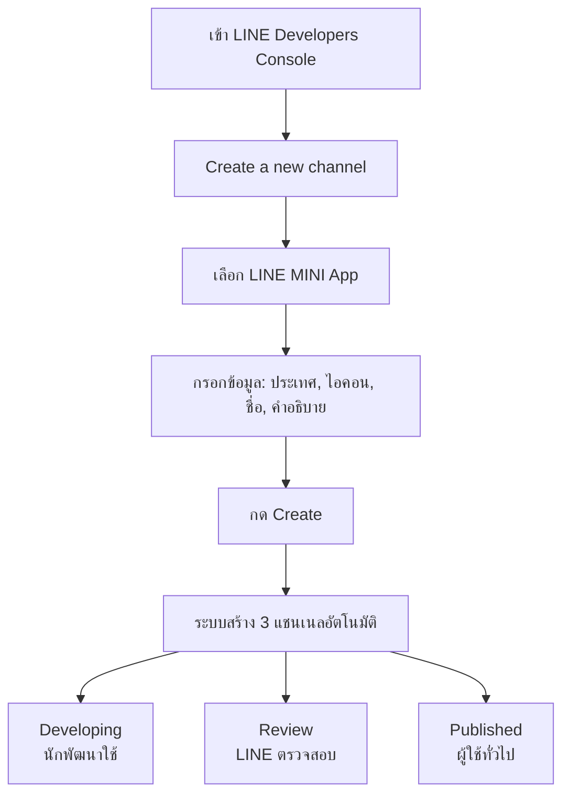
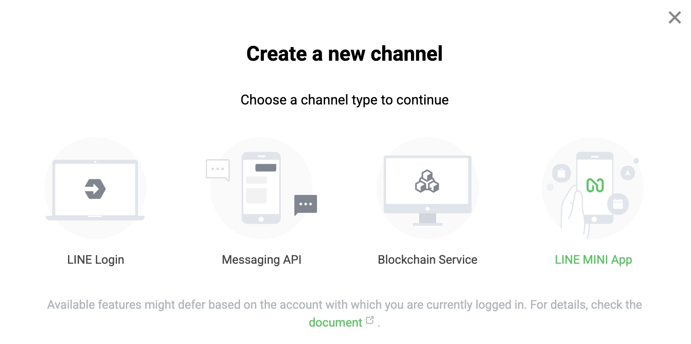
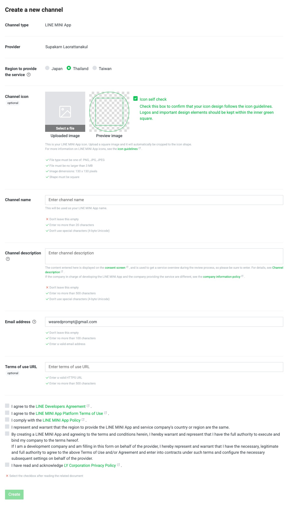
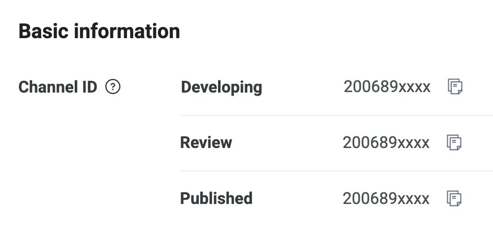
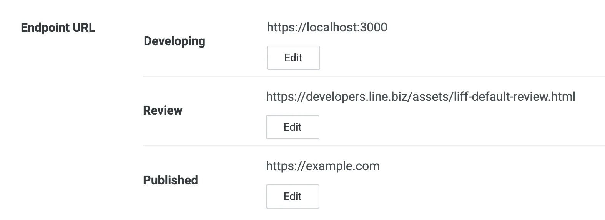
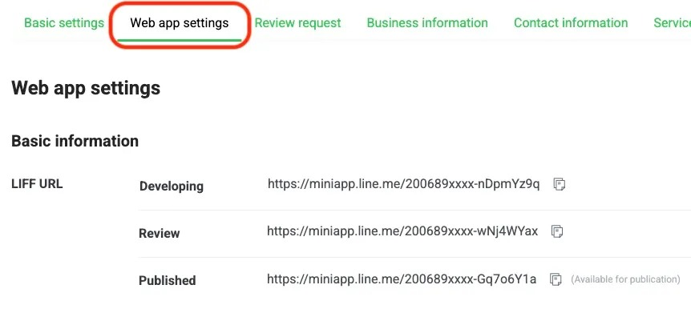

# เริ่มต้นพัฒนา LINE MINI App — สร้างแชนเนลและเข้าใจ 3 สภาพแวดล้อม

> ก่อนจะเขียนโค้ดแม้แต่บรรทัดเดียว เราต้องสร้าง "แชนเนล LINE MINI App" ใน LINE Developers Console ให้เรียบร้อยก่อน — จุดที่ทำให้หลายคนสับสนคือ **LINE MINI App หนึ่งตัวจะถูกสร้างเป็น 3 แชนเนลพร้อมกัน** (Developing, Review, Published) บทนี้จะพาไปสร้างและเข้าใจว่าแต่ละแชนเนลใช้ทำอะไร พร้อมวิธีย้ายโปรเจกต์จาก LIFF เก่ามาเป็น LINE MINI App

## ทำไมต้องรู้เรื่องนี้?

LINE MINI App ถูกออกแบบให้เหมาะกับแอประดับ Production มีการแบ่งสภาพแวดล้อมชัดเจน ไม่เหมือน LIFF ปกติที่ทุกอย่างอยู่ในแชนเนลเดียว การเข้าใจว่า **Developing/Review/Published** ทำอะไรบ้าง จะช่วยให้คุณวางโครงสร้างโปรเจกต์ตั้งแต่แรกได้อย่างถูกต้อง ไม่ต้องมาย้าย Endpoint กันทีหลัง

**ประโยชน์จริง:**
- วาง Environment ได้ตั้งแต่แรก (dev / staging / prod)
- รู้ว่าใครเข้าถึงแชนเนลไหนได้บ้าง
- ย้ายจาก LIFF เก่ามาเป็น LINE MINI App ได้โดยไม่ต้องเขียนโค้ดใหม่

## ภาพรวม

## สร้างแชนเนล LINE MINI App

### 1) เข้า Console และเลือก Provider

ใน [LINE Developers Console](https://developers.line.biz/console) เลือก Provider ที่ต้องการสร้าง กด `Create a new channel` จากนั้นเลือก `LINE MINI App`

### 2) กรอกข้อมูลของ LINE MINI App

- เลือกประเทศที่ให้บริการเป็น `Thailand`
- อัปโหลดรูปภาพไอคอนที่จะใช้งาน สัดส่วนสี่เหลี่ยมจตุรัส (1:1)
- กรอกชื่อแชนเนล (ชื่อของแอป)
- กรอกคำอธิบาย
- กรอกอีเมล
- กรอก URL ของข้อตกลงการใช้งาน (Terms of use)
- ยอมรับข้อตกลงและนโยบายทุกข้อ

### 3) กด Create

เมื่อกรอกครบแล้ว กด `Create` เพื่อสร้าง LINE MINI App

## สิ่งที่ต้องรู้ก่อนไปพัฒนา LINE MINI App

เมื่อสร้าง LINE MINI App เสร็จสิ้น สังเกตว่าจะมี **3 แชนเนลที่ถูกสร้างขึ้นมา** โดยแต่ละแชนเนลจะถูกสร้างขึ้นเพื่อแต่ละสภาพแวดล้อม

- **Developing** — สำหรับใช้ในการพัฒนา
- **Review** — สำหรับใช้การตรวจสอบจาก LINE
- **Published** — สำหรับเผยแพร่ให้ผู้ใช้ใช้งาน

แต่ละสภาพแวดล้อมจะมีการกำหนดบุคคลที่เข้าถึงได้ไว้ โดยมีรายละเอียดดังนี้

| สภาพแวดล้อม | บุคคลที่เข้าถึงได้                                 |
| ----------- | -------------------------------------------------- |
| Developing  | สมาชิกที่อยู่ในแชนเนลใน Role ตั้งแต่ Tester ขึ้นไป |
| Review      | ผู้ตรวจสอบจาก LINE (LY Corporation)                |
| Published   | ผู้ใช้ทั่วไป                                       |

ในแต่ละสภาพแวดล้อม เราจะสามารถตั้งค่า Endpoint แตกต่างกันได้ในแท็บ `Web app setting` และยังตั้งค่า `shareTargetPicker`, `Redirect non-LINE users to a web browser`, `Scope`, การเพิ่มเพื่อน และการใช้ QR Code ได้เหมือนกับในแชนเนล LINE Login

## เปลี่ยนจาก LIFF เป็น LINE MINI App

หากต้องการเปลี่ยนจาก LIFF เป็น LINE MINI App สามารถทำได้ง่าย ๆ โดยไม่ต้องเขียนโค้ดใหม่เลย

**ขั้นตอน:**

1. สร้าง LINE MINI App Channel ขึ้นมาใหม่
2. นำ URL ต้นทางของ LIFF App ที่เคยสร้างไว้ไปใส่ในช่อง `Endpoint URL` ของ LINE MINI App Channel ที่สร้างขึ้นมาใหม่
3. กด `Save`
4. นำ LIFF ID ของ LINE MINI App ในสภาพแวดล้อมที่ต้องการ ไปแทนที่ LIFF ID ในโค้ดของ LIFF App เดิม

สามารถดู LIFF ID ของ LINE MINI App ได้ในแท็บ `LIFF` ของ LINE MINI App Channel ที่สร้างขึ้นมาใหม่ โดยสามารถดูได้จาก `LIFF URL` ภายใต้แท็บ `Web app settings` (นำมาแค่ LIFF ID เท่านั้น ไม่ต้องนำ URL มาทั้งหมด)

สามารถดูรายละเอียดเพิ่มเติมได้ที่บทความ [ย้ายบ้านจาก LIFF สู่ LINE MINI App ได้ง่าย ๆ ยิ่งกว่าปอกกล้วย](https://medium.com/linedevth/liff-to-line-mini-app-01be2861a881)

## ข้อผิดพลาดที่มักเจอ

- **พลาด:** ใช้ LIFF ID จาก channel Published ตั้งแต่ช่วงพัฒนา ทำให้ทดสอบไม่ได้
  **ถูก:** ใช้ LIFF ID ของ channel **Developing** ในช่วงพัฒนา แล้วค่อยเปลี่ยนเป็นของ Published ก่อนขึ้น Production

- **พลาด:** ลืมเชิญทีม tester เข้า channel ทำให้ทีมเปิด MINI App ไม่ได้ในช่วงทดสอบ
  **ถูก:** เพิ่ม Role **Tester** ขึ้นไปให้สมาชิกที่ต้องการทดสอบบน channel Developing

- **พลาด:** ตั้ง Endpoint URL เป็น `http://localhost:3000` แล้วงงว่าทำไมเปิดใน LINE ไม่ได้
  **ถูก:** LINE ต้องการ HTTPS เท่านั้น ใช้ ngrok หรือ Cloudflare Tunnel เพื่อ expose localhost ออกมาเป็น URL https

- **พลาด:** สร้างแชนเนลใหม่ทุกครั้งที่ต้องการสภาพแวดล้อมใหม่
  **ถูก:** LINE MINI App แยก 3 สภาพแวดล้อมอัตโนมัติ (Developing/Review/Published) ใช้แชนเนลเดียวพอ

## Checklist ก่อนไปต่อ

- [ ] สร้างแชนเนล LINE MINI App ผ่าน LINE Developers Console แล้ว
- [ ] เข้าใจว่ามี 3 สภาพแวดล้อม: Developing / Review / Published
- [ ] ตั้ง Endpoint URL ในสภาพแวดล้อม Developing แล้ว
- [ ] มี LIFF ID ของ Developing สำหรับใช้ในโค้ด
- [ ] (ถ้าย้ายจาก LIFF) เปลี่ยน LIFF ID ในโค้ดเรียบร้อย

## อ้างอิง

- [LINE Developers Console](https://developers.line.biz/console)
- [LINE MINI App — Creating a channel](https://developers.line.biz/en/docs/line-mini-app/)
- [ย้ายบ้านจาก LIFF สู่ LINE MINI App ได้ง่าย ๆ ยิ่งกว่าปอกกล้วย](https://medium.com/linedevth/liff-to-line-mini-app-01be2861a881)
