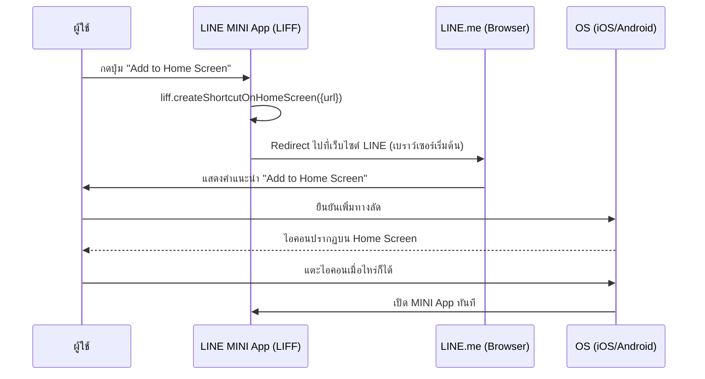

# Workshop: Add to Home Screen — ให้ผู้ใช้ปักหมุด MINI App ไว้หน้าจอโฮม

> ลูกค้าประจำจะกลับเข้าแอปของคุณง่ายแค่ไหน ถ้าเขาเพียงแค่**แตะไอคอนบนหน้าจอโฮมของมือถือ** แทนที่จะเปิด LINE → หาชื่อแอป → คลิก — ฟีเจอร์ **Add to Home Screen** ของ LINE MINI App ทำให้ MINI App ของคุณรู้สึกเหมือนเป็นแอปที่ติดตั้งจริงบนเครื่อง โดยไม่ต้องผ่าน App Store/Play Store

อีก 1 ฟีเจอร์ที่เป็นไฮไลต์ของ LINE MINI App นั้นคือ Add to Home Screen หรือเพิ่มทางลัดไปที่หน้าจอโฮมของอุปกรณ์ ใช้ได้กับ Verified MINI App เท่านั้น แต่อย่างไรก็ตามเรายังคงสามารถทดสอบการเพิ่มทางลัดได้ในสถาพแวดล้อม Developing ของ Unverified MINI App โดยสามารถทำได้ง่าย ๆ เรียกผ่านฟังก์ชันของ LIFF SDK

## ทำไมต้องรู้เรื่องนี้?

การ Retention (ทำให้ผู้ใช้กลับมาใช้แอปซ้ำ) คือโจทย์ใหญ่ของทุกแอป — ถ้า MINI App ของคุณอยู่แค่ใน LINE ผู้ใช้ต้องเปิดแอป LINE ก่อนทุกครั้ง กว่าจะเจอแอปคุณ ผ่านหลายขั้นตอน

**Add to Home Screen** แก้ปัญหานี้โดยให้ผู้ใช้**ปักหมุด MINI App ไว้หน้าจอโฮมได้เลย** แตะครั้งเดียวเปิด MINI App ทันที — ทำให้ MINI App รู้สึกเหมือน Native App ที่ติดตั้งผ่าน App Store แต่ไม่ต้องผ่านขั้นตอนการอนุมัติและไม่กินพื้นที่เครื่อง

**ประโยชน์จริง:**
- เพิ่ม Retention ได้มาก ผู้ใช้กลับมาง่ายขึ้น
- ไม่ต้องส่ง App เข้า App Store/Play Store
- ประสบการณ์เหมือน Native App — แตะไอคอนเปิดทันที

## ภาพรวม



## `liff.createShortcutOnHomeScreen()`

**หลักการทำงาน:** เมื่อเรียก `liff.createShortcutOnHomeScreen()` จะเกิดการ Redirect ไปยังเว็บไซต์ของ LINE ในเบราว์เซอร์เริ่มต้นของอุปกรณ์ แนะนำให้ผู้ใช้เพิ่มแอปไปยังหน้าจอโฮม

```typescript
liff.createShortcutOnHomeScreen({
  url: "<<MINI App URL>>",
});
```

**รายละเอียด:**

- URL ที่ใส่ใน Parameters จะต้องเป็น
  - LIFF URL
  - Permanent link
  - Endpoint URL ของ LINE MINI App
  - URL ที่ขึ้นต้นด้วย Endpoint URL ของ LINE MINI App

## ข้อควรรู้เกี่ยวกับแต่ละแพลตฟอร์ม

### Android

> **หมายเหตุ:** ในอุปกรณ์ Android บางรุ่น หากผู้ใช้เปลี่ยนไอคอนแอป LINE จาก **Settings** > **App icon** ทางลัดที่เพิ่มไว้ก่อนหน้านี้อาจถูกลบออก สามารถดูรายละเอียดเพิ่มเติมได้ที่ [LINE Help Center](https://help.line.me/line/smartphone/pc?lang=ja&contentId=200000315) (ภาษาญี่ปุ่นเท่านั้น)

### iOS — เงื่อนไขการทำงาน

หาก OS ของอุปกรณ์ผู้ใช้เป็น iOS การทำงานของปุ่ม **Add to Home** และเมธอด `liff.createShortcutOnHomeScreen()` จะขึ้นอยู่กับเบราว์เซอร์เริ่มต้นและเวอร์ชัน iOS ดังนี้ หากเรียกใช้ในสภาพแวดล้อมที่ไม่รองรับจะแสดงหน้า Error แทน

| เบราว์เซอร์เริ่มต้น | เวอร์ชัน iOS | สถานะการทำงาน |
| --- | --- | --- |
| Safari | ทุกเวอร์ชัน | ใช้งานได้ |
| Chrome | 16.4 ขึ้นไป | ใช้งานได้ |
| เบราว์เซอร์อื่นที่ไม่ใช่ Safari และ Chrome | 16.4 ขึ้นไป | ไม่รับประกันว่าจะใช้งานได้ |
| เบราว์เซอร์อื่นที่ไม่ใช่ Safari | ต่ำกว่า 16.4 | ใช้งานไม่ได้ |

ตัวอย่างเช่น หากเรียก `liff.createShortcutOnHomeScreen()` ในเบราว์เซอร์ Chrome บน iOS เวอร์ชันต่ำกว่า 16.4 จะแสดงหน้า Error

## ข้อผิดพลาดที่มักเจอ

- **พลาด:** ใช้กับ Unverified MINI App ใน Published แล้วไม่ทำงาน
  **ถูก:** ฟีเจอร์นี้เป็น Verified-only ในสภาพแวดล้อม Production — ทดสอบได้เฉพาะใน Developing ของ Unverified เท่านั้น ถ้าจะใช้จริงต้องยื่น Verify

- **พลาด:** ใส่ URL ภายนอก (เช่น google.com) ใน parameter `url`
  **ถูก:** URL ต้องเป็น LIFF URL / Permanent link / Endpoint URL ของ MINI App หรือ URL ที่ขึ้นต้นด้วย Endpoint URL เท่านั้น

- **พลาด:** ไม่เช็ค `liff.isApiAvailable('createShortcutOnHomeScreen')` ก่อนเรียก ทำให้ error บนอุปกรณ์ที่ไม่รองรับ
  **ถูก:** ตรวจสอบก่อนเรียกทุกครั้ง และซ่อนปุ่มเมื่ออุปกรณ์ไม่รองรับ

- **พลาด:** ทดสอบใน iOS Chrome เวอร์ชันต่ำกว่า 16.4 แล้วเจอหน้า Error แปลกใจ
  **ถูก:** iOS ต้องการ Safari (ทุกเวอร์ชัน) หรือ Chrome/อื่น ๆ ขั้นต่ำ 16.4 — ตรวจ `liff.getOS()` และแนะนำผู้ใช้ล่วงหน้า

- **พลาด:** เปลี่ยนไอคอนแอป LINE บน Android แล้วทางลัดหาย คิดว่าโค้ดเราเสีย
  **ถูก:** เป็นพฤติกรรม OS ของ Android บางรุ่น ไม่ใช่จากเรา — แนะนำผู้ใช้ในเอกสารช่วยเหลือ

## Checklist ก่อนไปต่อ

- [ ] ตรวจแล้วว่าเป็น Verified MINI App (ถ้าจะใช้ใน Production)
- [ ] เช็ค `liff.isApiAvailable('createShortcutOnHomeScreen')` ก่อนแสดงปุ่ม
- [ ] ส่ง URL ที่ถูกต้องตามเงื่อนไข (LIFF URL / Permanent link / Endpoint)
- [ ] ทดสอบแล้วทั้ง iOS Safari, iOS Chrome 16.4+, และ Android

## อ้างอิง

- [liff.createShortcutOnHomeScreen() — LIFF SDK](https://developers.line.biz/en/reference/liff/#create-shortcut-on-home-screen)
- [Add to Home Screen — LINE MINI App](https://developers.line.biz/en/docs/line-mini-app/develop/features/add-to-home-screen/)
- [LINE Help Center (Android icon issue)](https://help.line.me/line/smartphone/pc?lang=ja&contentId=200000315)
