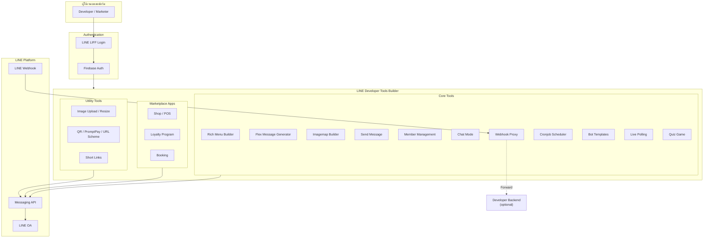

# LINE Developer Tools Builder — ภาพรวมแพลตฟอร์มที่รวมเครื่องมือ LINE Bot ไว้ในที่เดียว

> เคยทำ LINE Bot แล้วเจอปัญหา "ต้องใช้เครื่องมือ 7 ตัวจาก 7 เว็บ" ไหม? — ตัวหนึ่งไว้ออกแบบ Rich Menu อีกตัวไว้สร้าง Flex Message อีกตัวไว้ส่ง Broadcast อีกตัวไว้ตั้ง Cron — LINE Developer Tools Builder คือการรวมทุกเครื่องมือที่นักพัฒนา LINE ใช้บ่อย ๆ มาไว้ในที่เดียวกัน ใช้บัญชี LINE เดียวเข้าได้ทั้งหมด

> https://devtoolsbuilder.cloudea.tech/

## ทำไมต้องรู้เรื่องนี้?

ในโลกของการพัฒนา LINE OA นักพัฒนาและ Marketing มักเสียเวลาไปกับการสลับเครื่องมือต่าง ๆ:

- ออกแบบ Rich Menu ที่หนึ่ง
- สร้าง Flex Message อีกที่หนึ่ง
- ตั้ง Cronjob ไปหาเว็บ cron-job.org
- Debug Webhook ต้องไป tunnel เอง
- จัดการสมาชิกต้องเขียนโค้ดเก็บ User ID

**LINE Developer Tools Builder** รวมทั้งหมดนี้เข้าด้วยกัน พร้อมฟีเจอร์เสริมอย่าง Chat Mode, Quiz, Poll, Shop, Loyalty ที่สร้างบอทได้ทันทีโดยไม่ต้องเขียนโค้ด

## ภาพรวมสถาปัตยกรรมของแพลตฟอร์ม

## LINE Developer Tools Builder คืออะไร?

**LINE Developer Tools Builder** คือแพลตฟอร์มเว็บแอปพลิเคชันสำหรับนักพัฒนา LINE Bot ที่ช่วยให้คุณสร้าง, จัดการ และ deploy Rich Messaging Applications ได้อย่างง่ายดาย โดยไม่ต้องเขียนโค้ดทั้งหมดตั้งแต่ศูนย์

แพลตฟอร์มนี้รวมเครื่องมือสำคัญไว้ในที่เดียว ตั้งแต่การสร้าง Rich Menu, Flex Message, การจัดการสมาชิก ไปจนถึงระบบ E-commerce และ Loyalty Program

---

## Features

### 1. Rich Menu Builder

Visual Editor สำหรับสร้าง Rich Menu แบบ Drag-and-Drop

- ออกแบบ Rich Menu ด้วย 2D Canvas พร้อม Area Mapping
- Preview แบบ Real-time
- Template Gallery และ Design Library
- จัดการ Rich Menu Alias
- กำหนด Rich Menu ให้ผู้ใช้แต่ละคน (Per-user Assignment)
- Bulk Operations - Link/Unlink ให้ผู้ใช้หลายคนพร้อมกัน
- ตั้งเวลาสลับ Default Rich Menu อัตโนมัติ

---

### 2. Flex Message Generator

สร้าง Flex Message ได้ง่ายผ่าน Interactive Editor

- JSON Editor พร้อม Live Preview
- บันทึก Template สำหรับใช้ซ้ำ
- Flex Showcase มี Template สำเร็จรูปมากกว่า 20 แบบ
- Component Library สำหรับประกอบ Flex Message

---

### 3. Imagemap Builder

สร้าง Imagemap Message แบบ Interactive

- กำหนดพื้นที่คลิกได้บน Image (Clickable Area)
- ตั้งค่า Action Routing สำหรับแต่ละพื้นที่
- จัดการรูปภาพและ Versioning

---

### 4. Send Message (ส่งข้อความ)

รองรับการส่งข้อความทุกรูปแบบของ LINE Messaging API

| ประเภท | รายละเอียด |
|--------|-----------|
| Push Message | ส่งถึงผู้ใช้รายบุคคล |
| Multicast | ส่งถึงผู้ใช้หลายคนพร้อมกัน |
| Broadcast | ส่งถึงผู้ติดตามทั้งหมด |
| Narrowcast | ส่งถึงกลุ่มเป้าหมายเฉพาะ (Audience) |

- Preview ข้อความก่อนส่ง
- Quick Reply Templates
- ตั้งเวลาส่งข้อความล่วงหน้า (Scheduled Messages)
- ดูประวัติการส่งข้อความ (Message History)
- สถิติการส่ง (Delivery Analytics)

---

### 5. Member & Audience Management (จัดการสมาชิก)

#### Member Management
- ดูรายชื่อผู้ติดตาม LINE OA ทั้งหมด
- ข้อมูล Profile (ชื่อ, รูป, สถานะ)
- ระบบ Tagging และ Segmentation
- Import สมาชิกจาก CSV
- เชื่อมโยงสมาชิกด้วยเบอร์โทรศัพท์
- Sync Profile จาก LINE

#### Audience Groups
- สร้างและจัดการกลุ่มเป้าหมาย
- Click-based / Impression-based Audiences
- สร้างกลุ่มจากไฟล์

---

### 6. Chat Mode (แชทสด)

ระบบจัดการแชทแบบ Real-time สำหรับ Customer Support

- ดูและตอบข้อความแบบ Live Threading
- แสดง User Profile
- Quick Actions - ส่งสินค้า, ลิงก์จอง, คูปอง
- บันทึกโน้ตและ Reminder ในแต่ละบทสนทนา
- Response Templates
- ระบบ Tagging และ Unread Notification

---

### 7. Webhook Auto-Responses (ตอบกลับอัตโนมัติ)

สร้างกฎตอบกลับอัตโนมัติตาม Keyword

- Flexible Workflow Builder
- Response Templates
- Trigger Audience Tracking - ติดตามว่าใครถูก Trigger
- จัดกลุ่ม Workflow ได้

---

### 8. Bot Templates (แม่แบบบอท)

Template สำเร็จรูปมากกว่า 11 แบบ พร้อมใช้งานทันที

| Template | รายละเอียด |
|----------|-----------|
| Welcome Bot | บอทต้อนรับผู้ติดตามใหม่ |
| FAQ Bot | บอทตอบคำถามที่พบบ่อย |
| Survey Bot | บอทสำรวจความคิดเห็น |
| Quiz Bot | บอทเกมตอบคำถาม |
| Loyalty Program | บอทสะสมแต้ม |
| Event Promotion | บอทโปรโมทกิจกรรม |
| Lead Generation | บอทเก็บข้อมูลลูกค้า |
| Customer Support | บอทช่วยเหลือลูกค้า |
| Appointment Booking | บอทจองนัดหมาย |
| Feedback Collection | บอทเก็บ Feedback |
| Newsletter Bot | บอทส่งข่าวสาร |
| Poll Bot | บอทโหวตสำรวจ |

- Customization Wizard
- สร้างบอทด้วย One-click
- AI-Assisted Generation
- Preview ก่อนสร้าง

---

### 9. Live Polling (โหวตสด)

ระบบโหวตแบบ Real-time

- สร้าง Poll แบบ Multiple Choice
- หน้า Voter Interface สำหรับผู้โหวต (ผ่าน LIFF)
- หน้า Presenter Mode สำหรับแสดงผลบนจอ
- ดูผลโหวตแบบ Live
- Export ข้อมูลการโหวต

---

### 10. Quiz Game (เกมตอบคำถาม)

ระบบ Quiz แบบ Kahoot-style

- สร้างคำถาม Multiple Choice และ True/False
- Timer-based Questions
- Leaderboard พร้อมคะแนน
- หน้า Host สำหรับผู้จัด
- หน้า Player สำหรับผู้เล่น (ผ่าน LIFF)
- ประวัติการเล่นและสถิติ

---

### 11. Marketplace Apps (แอปเสริม)

แพลตฟอร์มรองรับ Extension Apps ที่เชื่อมต่อกับ LINE OA ได้

#### Shop App (ระบบร้านค้า)
- หน้า POS (Point of Sale)
- จัดการสินค้าและสต็อก
- ระบบ Order Management
- Kitchen Display System (KDS) สำหรับร้านอาหาร
- รายงานยอดขาย
- ระบบใบเสร็จ + QR Code

#### Loyalty Program (ระบบสะสมแต้ม)
- กำหนดกฎการสะสมแต้ม
- จัดการ Reward และ Voucher
- ระบบ Tier สมาชิก
- Dashboard แสดงสถิติ

#### Booking App (ระบบจอง)
- จัดการ Time Slot
- ปฏิทินการจอง
- แจ้งเตือนนัดหมาย
- ยืนยัน/ยกเลิกการจอง

---

### 12. Utility Tools (เครื่องมือเสริม)

| เครื่องมือ | รายละเอียด |
|-----------|-----------|
| Image Upload | อัปโหลดรูปภาพพร้อมตั้งวันหมดอายุ |
| Image Resize | ปรับขนาดรูปตามข้อกำหนด LINE |
| QR Generator | สร้าง QR Code สำหรับ LINE |
| PromptPay QR | สร้าง QR พร้อมเพย์ |
| LINE URL Scheme | สร้าง Deep Link สำหรับ LINE |
| Short Links | ระบบย่อลิงก์พร้อม Click Analytics |
| LINE Beacon | ตั้งค่า Beacon สำหรับ Proximity Messaging |

---

### 13. Webhook Proxy & Event Logging

- Proxy Webhook Events ไปยัง Endpoint ของคุณ
- บันทึก Event Log ทั้งหมด
- สถิติ Webhook
- ตรวจสอบ Event History

---

### 14. Cronjob Scheduler (ตั้งเวลาทำงาน)

- ตั้งเวลาทำงานซ้ำ ๆ อัตโนมัติ
- รองรับ Cron Expression
- บันทึก Log การทำงาน
- ทดสอบ Dry-run ก่อนใช้งานจริง

---

### 15. AI Integration

- ใช้ Google Gemini สำหรับ OCR และสร้างเนื้อหา
- AI-Assisted Flex Message Generation
- AI Content Generation

---

### 16. Coupon Manager (จัดการคูปอง)

- สร้างคูปอง LINE ผ่าน API
- แจกจ่ายคูปอง
- ติดตามการใช้งาน
- จัดการสถานะคูปอง

---

## ระบบ Multi-Tenancy & Package

แพลตฟอร์มรองรับหลายผู้ใช้งาน พร้อมระบบ Package

| Package | รายละเอียด |
|---------|-----------|
| Free | เริ่มต้นใช้งานฟรี มีข้อจำกัดจำนวนข้อความและพื้นที่จัดเก็บ |
| Pro | ปลดล็อคฟีเจอร์เพิ่มเติม เพิ่ม Quota |
| Business | เต็มรูปแบบ สำหรับธุรกิจ |

---

## ความปลอดภัย

- Firebase Auth + LINE LIFF Authentication
- Role-based Access Control (Owner, Admin, Member)
- เข้ารหัส Channel Credentials
- Webhook Validation
- Audit Log สำหรับทุก Action

---

## รองรับ 2 ภาษา

- ภาษาไทย
- ภาษาอังกฤษ (English)

สลับภาษาได้ทันทีผ่าน Language Switcher บนแพลตฟอร์ม

---

## ข้อผิดพลาดที่มักเจอ

- **พลาด:** คิดว่าแพลตฟอร์มนี้แทน LINE Developers Console ได้ทั้งหมด
  **ถูก:** ยังต้องสร้าง Channel และเปิด Messaging API ที่ [LINE Developers Console](https://developers.line.biz/console/) ก่อน แล้วนำ Channel ID/Secret มาใส่ในแพลตฟอร์ม

- **พลาด:** สร้าง Rich Menu ผ่าน OA Manager แล้วมาแก้ต่อใน Tools Builder ไม่ได้
  **ถูก:** Rich Menu ถูกล็อคกับเครื่องมือที่สร้าง — Tools Builder ใช้ Messaging API ดังนั้นเมนูที่สร้างจะแก้ผ่าน OA Manager ไม่ได้ และในทางกลับกันเช่นกัน

- **พลาด:** ใช้ Free Package แล้วสงสัยว่าทำไมส่งข้อความได้จำกัด
  **ถูก:** Package Free มี quota จำกัด ดูรายละเอียดในคู่มือฉบับละเอียด (11-02) และอัปเกรดเมื่อจำเป็น

- **พลาด:** ใช้ Chat Mode / Cronjob / Webhook Proxy บน Free Package แล้วเมนูไม่แสดงผล
  **ถูก:** ฟีเจอร์เหล่านี้ต้องใช้ Package **PRO** ขึ้นไป

## Checklist ก่อนไปต่อ

- [ ] มี LINE OA และเปิด Messaging API Channel เรียบร้อย
- [ ] เตรียม Channel ID และ Channel Secret ไว้พร้อมใช้
- [ ] เข้าใจว่าแพลตฟอร์มทำงานผ่าน Messaging API (ไม่ใช่ OA Manager)
- [ ] เลือก Package ที่เหมาะกับการใช้งาน (Free / Pro / Business)
- [ ] รู้ว่าฟีเจอร์ PRO ใดที่ตัวเองต้องใช้ เช่น Chat Mode, Cronjob, Webhook Proxy

## สรุป

LINE Developer Tools Builder เป็นแพลตฟอร์มครบวงจรสำหรับนักพัฒนา LINE ที่ต้องการ:

- สร้างและจัดการ LINE Bot ได้ง่ายและรวดเร็ว
- ใช้เครื่องมือ Visual Editor แทนการเขียนโค้ดทั้งหมด
- ขยายความสามารถด้วย Marketplace Apps (Shop, Loyalty, Booking)
- สร้างประสบการณ์ Interactive ด้วย Quiz, Poll, Chat Mode
- จัดการสมาชิกและ Audience อย่างเป็นระบบ
- Automate งานซ้ำ ๆ ด้วย Webhook Auto-responses และ Cronjob

## อ้างอิง

- [LINE Developer Tools Builder](https://devtoolsbuilder.cloudea.tech/)
- [LINE Developers Console](https://developers.line.biz/console/)
- [LINE Messaging API Reference](https://developers.line.biz/en/reference/messaging-api/)
- [LINE LIFF Documentation](https://developers.line.biz/en/docs/liff/)
